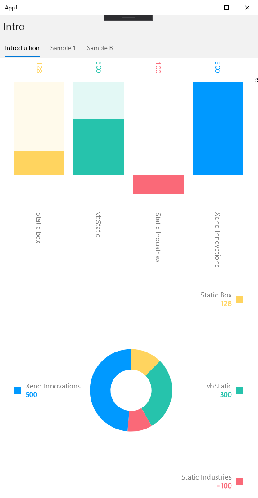
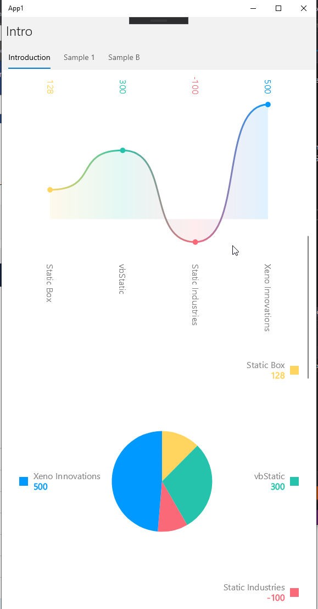
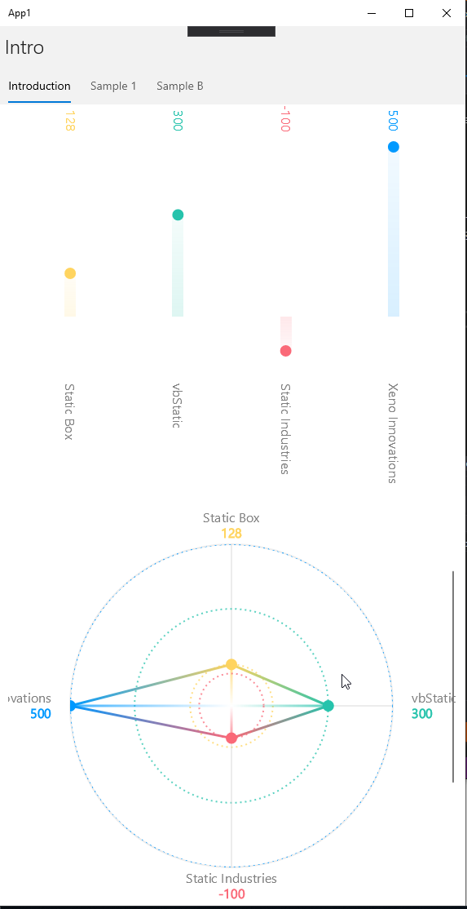
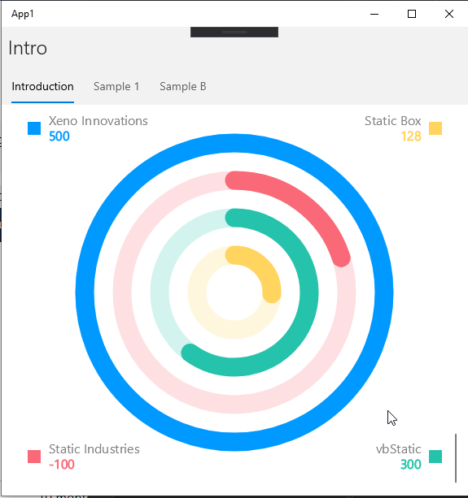
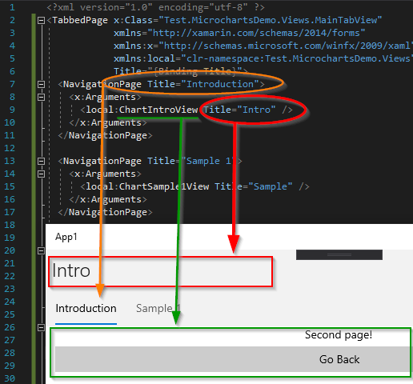

# Overview
This demonstrates a test app for the various Microcharts' charts in C# using Xamarin for mobile and desktop development.

## Microcharts Demo
In this demo we're using [MoneyFox's Microcharts](https://github.com/MoneyFox/Microcharts) because their NuGet is a little more up-to-date with bugfixes (*Oct, 2019*) vs the main [Microcharts](https://github.com/dotnet-ad/Microcharts)'s last update of Feb, 2019.

Many thanks goes out to the Microcharts team! We're checking out your repo and we're excited for what you're doing.

### Types of charts

```csharp
var chart = new BarChart() { Entries = entries };
var chart = new DonutChart() { Entries = entries };
var chart = new LineChart() { Entries = entries };
var chart = new PieChart() { Entries = entries };
var chart = new PointChart() { Entries = entries };
var chart = new RadarChart() { Entries = entries };
var chart = new RadialGaugeChart() { Entries = entries };
```






### Prism Tabs
This example also demonstrates Prism Tabs. As an FYI, we're currently only using the main page.

```csharp
  <NavigationPage Title="Introduction">
    <x:Arguments>
      <local:ChartIntroView Title="Intro" />
    </x:Arguments>
  </NavigationPage>

  <NavigationPage Title="Sample 1">
    <x:Arguments>
      <local:ChartSample1View Title="Sample A" />
    </x:Arguments>
  </NavigationPage>

  <local:ChartSample2View Title="Sample B" />
```




### References
* [MoneyFox.Microcharts](https://github.com/MoneyFox/Microcharts)
* [Microcharts](https://github.com/dotnet-ad/Microcharts)
* [Prism with DryIoc](https://github.com/PrismLibrary/Prism)
* Xamarin.Forms
